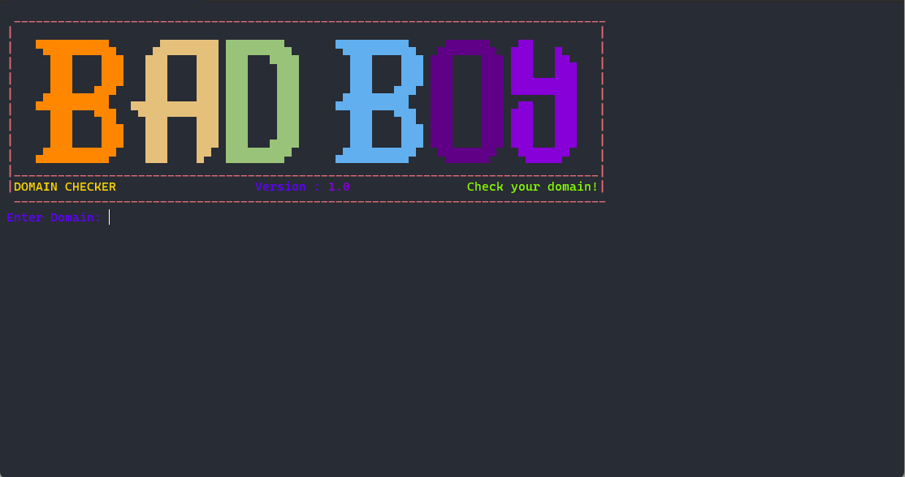
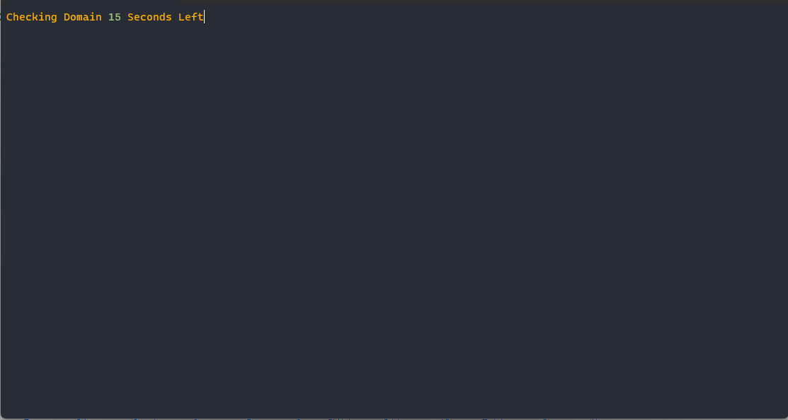
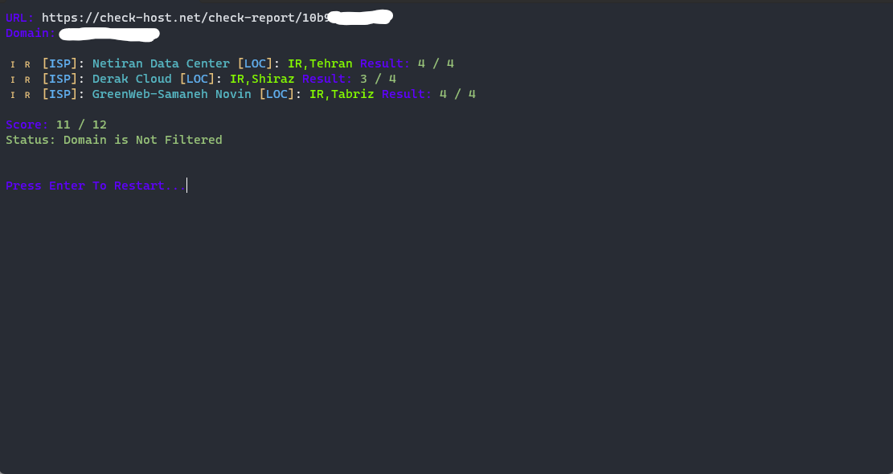

# 🌐 تست دامنه 🌐

دیگه نگران فیلتر بودن کانفیگ خودتون برای اپراتور های مختلف نباشید ! 😮

این یک ابزار فوق العاده است که به شما امکان می دهد بررسی کنید که آیا دامنه شما در ایران فیلتر شده است یا خیر. تست از 3 شهر تهران ، شیراز و تبریز انجام میشود.

این پروژه یک همکاری بین [bardiafa](https://github.com/Bardiafa) و [Hossein-M](https://github.com/hossein-mohseni) است. 🤝

## 🚀 شروع کار 🚀

1. فایل domainchecker.exe را از قسمت [releases](https://github.com/hossein-mohseni/domain-checker/releases/tag/v1.0) دانلود کنید.
2. فایل domainchecker.exe را در ویندوز خود اجرا کنید. شما باید پنجره ای مشابه این ببینید:
   
4. دامنه ای که می خواهید بررسی شود را وارد کنید، سپس `enter` بزنید.
5. باید 15 ثانیه صبر کنید :
   
6. نتیجه تست به این شکل نمایش داده میشود :
   

## 💢 توضیح نتایج 💢
نتایج تست به 4 مدل نشان داده میشود :
1. Domain Filtered (دامنه شما روی همه اپراتورها __فیلتر__ شده)
2. Domain Not Filtered (دامنه شما باید روی همه اپراتورها __پاسخگو__ باشد زیرا فیلتر نیست)
4. Domain Partially Filtered (دامنه شما نیمه فیلتر شده و __ممکن__ است روی بعضی از اپراتورها فیلتر باشد)
5. Domain Not Configured (دامنه شما روی جایی __ست__ نشده و امکان تست وجود ندارد)

## 📝 مجوز 📝

این پروژه تحت شرایط مجوز [MIT](https://github.com/hossein-mohseni/domain-checker/blob/main/LICENSE) است.

## 🤝 مشارکت 🤝

به راحتی با ایجاد issue میتوانید ایده خود را برای بهتر شدن این پروژه ، با ما به اشتراک بزارید.

از استفاده از بررسی کننده دامنه لذت ببرید! 🎉

---------------------------------------------

# 🌐 Domain-Checker 🌐

Welcome to Domain-Checker! This is an awesome tool that allows you to check if your domain is filtered in Iran. It checks across 3 different cities for comprehensive results. This project is a collaboration between @hossein-m and @bardiafa.

## 🚀 Getting Started 🚀

1. Download the domainchecker.exe file from [Releases](https://github.com/hossein-mohseni/domain-checker/releases/tag/v1.0).
2. Run the domainchecker.exe file on your Windows machine. You should see a window like this:

4. Enter your domain to be checked,after you should see as shown here:

6. Results should be seen like this:
 

## 💢 Result Scenarios 💢
Result are one of these:

1. Domain Filtered 
2. Domain Not Filtered 
4. Domain Partially Filtered
5. Domain Not Configured

## 📝 License 📝

This project is licensed under the terms of the [MIT license](https://github.com/hossein-mohseni/domain-checker/blob/main/LICENSE).

## 🤝 Contributing 🤝

Contributions are welcome! Feel free to open an issue or submit a pull request.

Enjoy using Domain-Checker! 🎉
